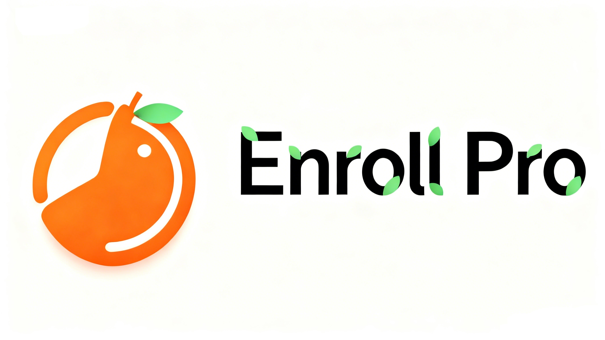

[English version](README.md) | 中文版 



[](/LICENSE)
[](https://github.com/Project-HAMi/HAMi/actions/workflows/ci.yaml)
[](https://github.com/Project-HAMi/HAMi/releases/latest)
[](https://www.bestpractices.dev/en/projects/9416)
[](https://goreportcard.com/report/github.com/Project-HAMi/HAMi)
[](https://codecov.io/gh/Project-HAMi/HAMi)
[](https://app.fossa.com/projects/git%2Bgithub.com%2FProject-HAMi%2FHAMi?ref=badge_shield)
[](https://hub.docker.com/r/projecthami/hami)
[](https://cloud-native.slack.com/archives/C07T10BU4R2)
[](https://github.com/Project-HAMi/HAMi/discussions)
[](http://project-hami.io)
[](https://github.com/Project-HAMi/HAMi#contact)

## Enroll Pro: 可定制化报名系统

## 简介

可定制化的报名系统，适用于考试报名系统，活动报名系统等任何报名形式的场景，可用于生产、企业级别的项目。 项目和代码经过严格审核测试，支持私有化部署。

## 系统技术架构

后端: Java:8、SpringBoot:2.5.15、Mybatis、Gradle、Minio
前端：Vue3
数据库：Mysql:8.0.21、Redis:latest
部署: Docker、Docker-compose

## 快速开始

### 前置条件

运行系统服务器前置条件如下：

- 操作系统 = centos、Ubuntu、Debian
- 系统硬盘 > 40G
- 运行内存 > 4G
- 部署依赖软件 = docker、docker-compose

### 启动运行

首先，进入根目录下deploy下执行以下命令：。

```
kubectl label nodes {nodeid} gpu=on
```

在 helm 中添加我们的仓库

```
helm repo add hami-charts https://project-hami.github.io/HAMi/
```

使用以下命令进行部署：

```
helm install hami hami-charts/hami -n kube-system
```

通过调整[配置](docs/config.md)来自定义你的安装。

使用以下命令验证你的安装：

```
kubectl get pods -n kube-system
```

如果 `vgpu-device-plugin` 和 `vgpu-scheduler` pod 都处于 *Running* 状态，则安装成功。你可以在[这里](examples/nvidia/default_use.yaml)尝试示例。

### Web 界面演示环境

[用户端](https://www.enrollpro.top) 报名界面，用户使用的门户界面

[企业端](https://enterprise.enrollpro.top) 企业管理界面，用于企业管理自己企业发布的报名信息，报名信息审核维护等。

[管理端端](https://admin.enrollpro.top) 系统管理界面，用于维护系统，用户管理、权限角色、日志监控等。

```
测试账号可自行注册，也可使用预置的超级管理员账号（账号：123@qq.com 密码：Hh123@qqcom）。
```

### 监控

安装后自动启用监控。通过访问以下 URL 获取集群信息概览：

```
http://{scheduler ip}:{monitorPort}/metrics
```

默认 monitorPort 为 31993；可以在安装时使用 `--set devicePlugin.service.httpPort` 设置其他值。

Grafana 仪表板[示例](docs/dashboard.md)

> **注意** 在提交任务之前不会收集节点状态

## 注意事项

- 如果在使用带有 NVIDIA 镜像的设备插件时不请求虚拟 GPU，机器上的所有 GPU 可能会在容器内暴露
- 目前，A100 MIG 仅支持 "none" 和 "mixed" 模式
- 带有 "nodeName" 字段的任务目前无法调度；请使用 "nodeSelector" 代替

## 社区治理

本项目由一组 [维护者](./MAINTAINERS.md) 和 [贡献者](./AUTHORS.md) 管理。他们的选择和管理方式在我们的[治理文档](https://github.com/Project-HAMi/community/blob/main/governance.md)中有详细说明。

如果你有兴趣成为贡献者并希望参与 HAMi 代码开发，请查看 [CONTRIBUTING](CONTRIBUTING.md) 了解提交补丁和贡献工作流程的详细信息。

查看[路线图](docs/develop/roadmap.md)了解你感兴趣的内容。

## 会议与联系方式

HAMi 社区致力于营造开放和友好的环境，提供多种方式与其他用户和开发者互动。

如果你有任何问题，请随时通过以下渠道与我们联系：

- 常规社区会议：每周五 16:00（UTC+8）（中文）。[转换为你的时区](https://www.thetimezoneconverter.com/?t=14%3A30&tz=GMT%2B8&)。
  - [会议记录和议程](https://docs.google.com/document/d/1YC6hco03_oXbF9IOUPJ29VWEddmITIKIfSmBX8JtGBw/edit#heading=h.g61sgp7w0d0c)
  - [会议链接](https://meeting.tencent.com/dm/Ntiwq1BICD1P)
- 电子邮件：请参考 [MAINTAINERS.md](MAINTAINERS.md) 查找所有维护者的电子邮件地址。如有任何问题或需要报告问题，请随时通过电子邮件联系他们。
- [邮件列表](https://groups.google.com/forum/#!forum/hami-project)
- [Slack](https://cloud-native.slack.com/archives/C07T10BU4R2) | [加入](https://slack.cncf.io/)

## 演讲和参考资料

|                  | 链接                                                                                                                    |
|------------------|-------------------------------------------------------------------------------------------------------------------------|
| 中国云计算基础架构开发者大会 (Beijing 2024) | [在 Kubernetes 集群式解锁异构 AI 基础设施](https://live.csdn.net/room/csdnnews/3zwDP09S) Starting from 03:06:15 |
| KubeDay(Japan 2024) | [Unlocking Heterogeneous AI Infrastructure K8s Cluster:Leveraging the Power of HAMi](https://www.youtube.com/watch?v=owoaSb4nZwg) |
| KubeCon & AI_dev Open Source GenAI & ML Summit(China 2024) | [Is Your GPU Really Working Efficiently in the Data Center?N Ways to Improve GPU Usage](https://www.youtube.com/watch?v=ApkyK3zLF5Q) |
| KubeCon & AI_dev Open Source GenAI & ML Summit(China 2024) | [Unlocking Heterogeneous AI Infrastructure K8s Cluster](https://www.youtube.com/watch?v=kcGXnp_QShs)                                     |
| KubeCon(EU 2024)| [Cloud Native Batch Computing with Volcano: Updates and Future](https://youtu.be/fVYKk6xSOsw) |

## 许可证

HAMi 采用 Apache 2.0 许可证。详情请参见 [LICENSE](LICENSE) 文件。

## Star 趋势

[](https://star-history.com/#Project-HAMi/HAMi&Date)
